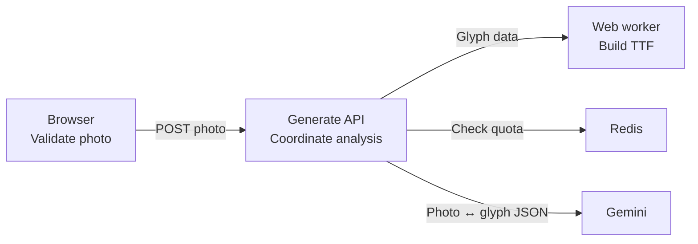

# Simple Architecture Diagrams

`draw_architecture` explains how work moves across a codebase:

1. Codex reads the repository.
2. Codex identifies the main user flow and its supporting services.
3. The MCP server validates the small model and renders a repo-local `.tldr` board.

The goal is understanding, not exhaustive documentation.

## What to include

Show only:

- Three to seven main runtime components.
- Two to four components in the main user flow.
- At most three important actions per component.
- One short arrow per interaction, combining request and response.
- At most two short errors inside the component that returns them.

Keep libraries and helpers inside the action that uses them. Do not turn every file or dependency into a component.

## Input model

Components contain short actions and errors:

```json
{
  "id": "generate-api",
  "label": "Generate API",
  "actions": [
    "Check the upload limit",
    "Analyze the photo",
    "Validate returned letter data"
  ],
  "errors": ["429 upload limit reached", "502 analysis failed"],
  "evidence": ["src/api/generate.ts"]
}
```

`primaryFlow` lists only the components in the main user path:

```json
["browser", "generate-api", "web-worker"]
```

Connections describe one interaction between two components:

```json
{
  "from": "browser",
  "to": "generate-api",
  "call": "POST photo",
  "evidence": ["src/app.ts", "src/api/generate.ts"]
}
```

`errors` and `evidence` are optional. Evidence stays in shape metadata. Do not add a second arrow for a response. Use one label such as `Photo ↔ glyph JSON`.

## Example


